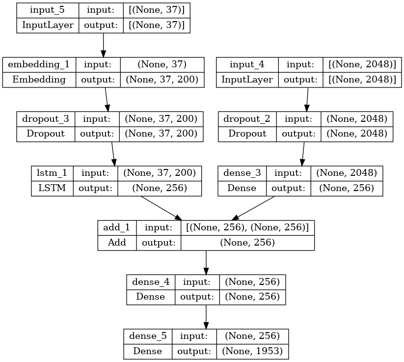

## Description:
Generate caption of an input image

## Project type:
Computer Vision + Natural Language Processing

## Programming language: 
Python

## Libraries:
TensorFlow, Glob

## Models:
- For image feature extraction: InceptionV3
- For embeddings: GloVe
- For image captioning:

